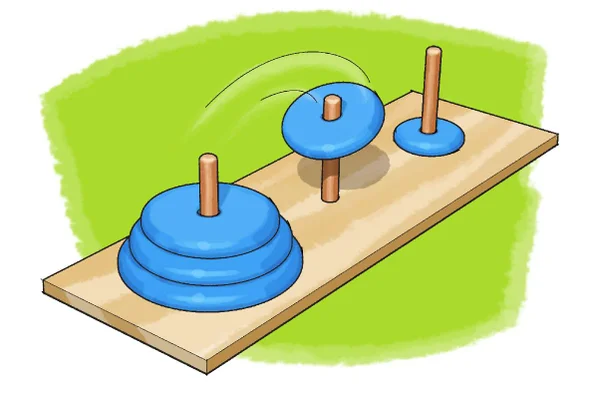
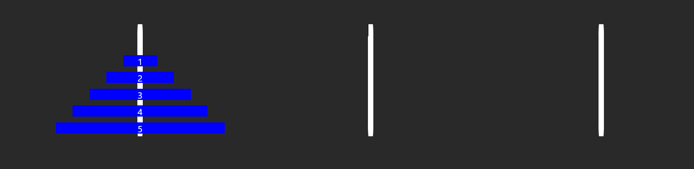
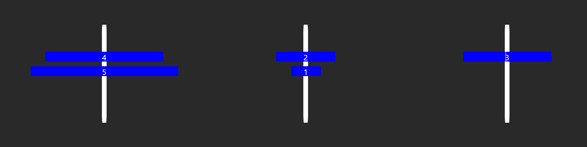

# Tower Of Hanoi

#### Bu uygulamayı [webdevcody](https://www.youtube.com/@WebDevCody) You Tube kanalındaki Tower of Hanoi challenge'ı için yaptım.

#### Tower of Hanoi (Hanoi Kulesi), üç direği olan ve her bir direğin üzerinde farklı boyutlarda disklerin yer aldığı bir matematiksel oyun veya bulmacadır. Oyun, 19. yüzyılda Fransız matematikçi Edouard Lucas tarafından icat edilmiştir.Oyunda amaç, tüm diskleri birinci direkten üçüncü direğe taşımaktır. Ancak, sadece en üstteki diski taşıyabilirsiniz ve herhangi bir disk daha büyük bir diskin üstüne yerleştirilemez. Ayrıca, diskleri sadece bir disk ya da boş bir direğin üzerine taşıyabilirsiniz.

 

## Metotlar ve Teknolojiler
#### Uygulama React kütüphanesi ile yazılmıştır. Challenge kod uzunluğu açısından uzun olmadı, doğru state yönetimi ile uygulamayı doğru şekilde çalıştırdım. Diskleri çubuklar arası gezdirme işlemi şöyle: çubuklara her tıkladğınızda, o çubukta bulunan en üsteki disk seçilir ve ikinci tıklanan çubuğa yerleşir. Bu şekilde diskler çubuklar arası gezmiş olur.

